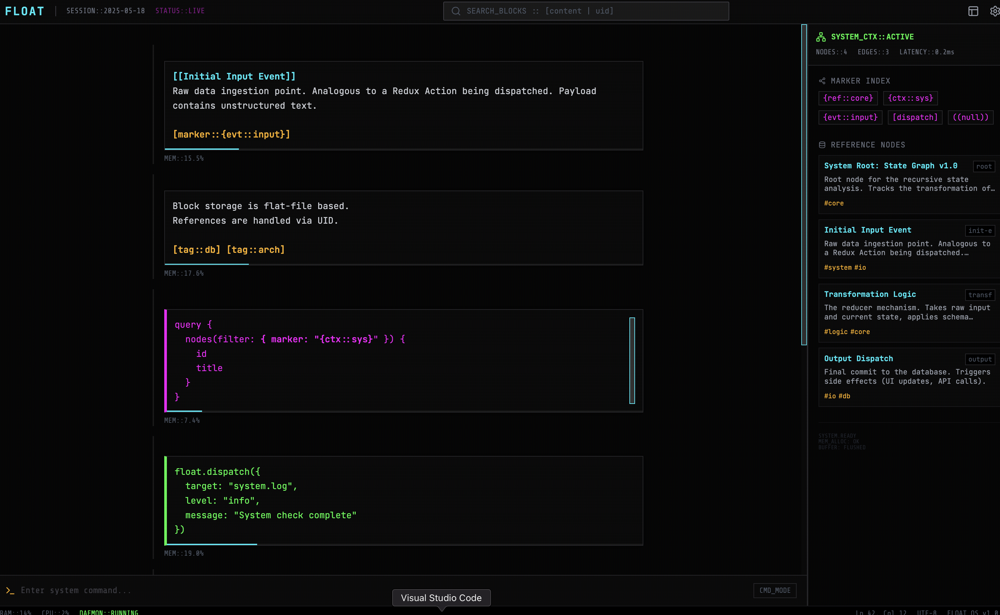
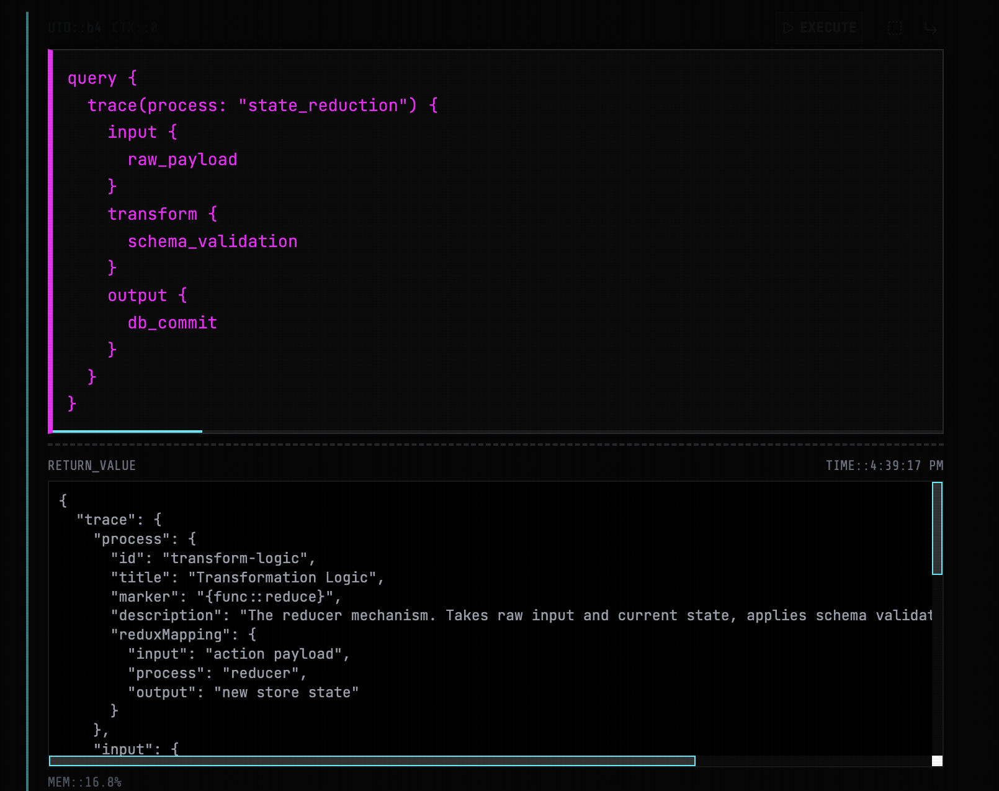

# FLOAT.terminal // CORE_SYSTEM



**FLOAT.terminal** is a TUI-inspired (Text User Interface), block-based atomic note editor designed to bridge the gap between unstructured human thought and structured system data. 

It utilizes a retro-cyberpunk aesthetic (scanlines, neon palette, monospace typography) to create a focused, "void-like" environment for knowledge management. Unlike traditional document editors, FLOAT treats every paragraph as an addressable "block" that can be threaded recursively, queried via AI, or linked to a persistent knowledge graph.

## 🌟 Key Features

*   **Atomic Block Architecture**: Content is broken down into discrete blocks. Each block can be split horizontally or threaded vertically (recursive children).
*   **System Context (The Graph)**: A sidebar visualizing a "Knowledge Graph" (AST). Users can click nodes to "inject" past context into their current workflow.
*   **Fuzzy Compiling (LLM Integration)**: Built-in support for Google Gemini (`gemini-2.5-flash`). Users can write natural language or pseudo-code queries (e.g., "Find all core nodes") which the system compiles into executable JSON results.
*   **Live Syntax Highlighting**:
    *   `[[Wikilinks]]` (Cyan)
    *   `[Tags]` (Amber)
    *   `{Markers}` (Pink - formerly Sigils)
*   **Immersive UI**: Custom CRT scanline overlays, terminal aesthetics, and keyboard-centric navigation logic.

## 🛠️ Installation & Setup

### Prerequisites
*   Node.js (v18 or higher)
*   A Google Gemini API Key

### Steps

1.  **Clone the Repository**
    ```bash
    git clone https://github.com/your-username/float-terminal.git
    cd float-terminal
    ```

2.  **Install Dependencies**
    ```bash
    npm install
    ```

3.  **Configure API Key**
    Create a `.env` file in the root directory:
    ```env
    API_KEY=your_google_gemini_api_key_here
    ```

4.  **Start the Application**
    ```bash
    npm start
    ```
    The app will boot up at `http://localhost:3000`.

## 🎮 Usage Guide

### The Interface
*   **The Void (Center)**: Your main workspace. This is an infinite scroll of block threads.
*   **System Context (Right)**: Read-only view of your persistent knowledge base. Click a node to reference it.
*   **Command Line (Bottom)**: (Visual only in v1) Placeholder for global system commands.

### Block Types
1.  **Text Block**: Standard Markdown-flavored writing.
2.  **Query Block**: Special pink-bordered blocks. Type a request (e.g., `query { nodes with tag "core" }`) and click **EXECUTE**. The AI will parse your intent against the Context Graph and return JSON.
3.  **Dispatch Block**: Special green-bordered blocks. Used to simulate sending commands to an external system (e.g., `dispatch log to console`).

### Shortcuts & Syntax
*   **Thread**: Click the `CornerDownRight` icon to create a child block.
*   **Links**: Wrap text in `[[double brackets]]` to highlight it as a link.
*   **Tags**: Wrap text in `[brackets]` for tags.
*   **Markers**: Wrap text in `{braces}` for system markers.
